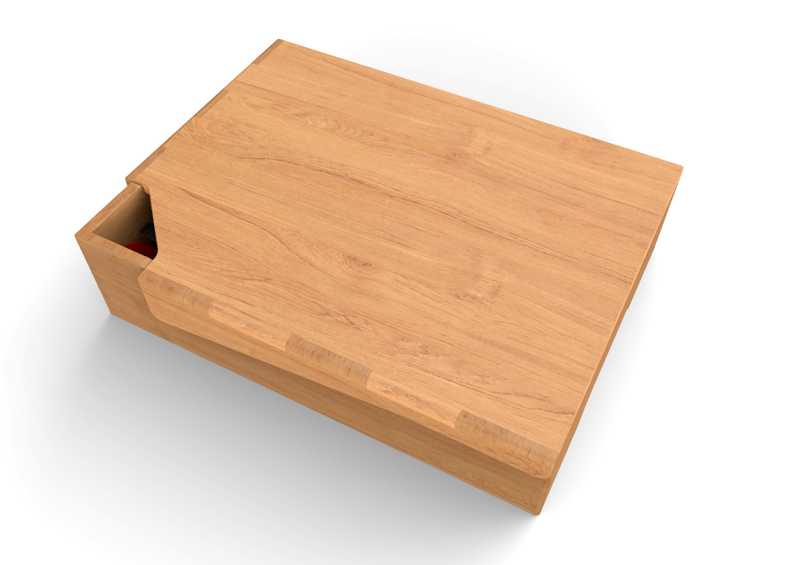
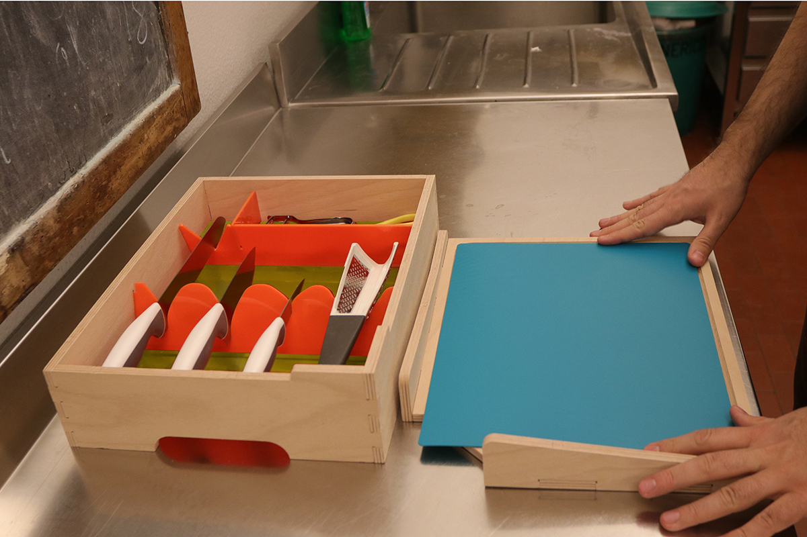

# PIC-AP
## PIccola Cucina Accessibile Portatile (Small Portable Accessible Kitchen)
### Hackability@Barilla 2017

 - Comfort zone
 - Area protetta (protected area)
 - Vademecum
 - Zona franca (free zone)

## Personal kit and minimum laptop to prepare food.

### Scenario

Marco, visually impaired, needs an extremely organized workspace to cook in safety and with comfort. Work tools must always be in the same position and be easily distinguishable by contrast and color. PIC-AP offers a "comfort zone": a minimal and personal working environment, where the visually impaired people can work safely, having the certainty of finding his instruments.
The functionality of the project makes an appropriate tool to give (or re-give) the ability to prepare food anywhere and independently, making it a product suitable for different types of users. It’s not connoted as equipment for people with disabilities.

### What problems does it solve:

- order and availability of objects
- possibility of arranging according to the desired lighting
- possibility to bring the kit where we want (in another room or in another house!)

### Toolbox contents:

The kit is custom designed from IKEA kitchen utensils, easy to find and affordable.
- chopping board
- 3 knives
- scissor
- potato peeler
- cheese grater

## Visual requirements:
- avoid dazzling / transparent materials that do not reflect light
- Prepare opaque materials
- have chromatic contrasts of at least 70% (consult color contrast tables)
- avoid using too many colors
- take into account the different situations of low vision

## Hot to reproduce it

1. Use the files “lasercut” to cut the plexiglass 4mm
2. Use the files “cnc mill” to cut wood 10mm, we suggest Beech wood
3. The wood parts must be painted with natural impregnating agent
4. Use the wooden parts to build the top that is the cutting board
5. Use the remaining wooden and plexiglass parts to build the box
6. Wash all the parts and wait until it’s dry
7. Start use PIC-AP

## Credits:
- Marco Boneschi 
- Fabrizio De Paoli (designer), info@digitalfucina.com
- Sebastiano Ercoli (designer), sebastiano.ercoli@gmail.com
- Rosa Garofalo, rgarofalo@subvedenti.it
- Alberto Ghirardello (designer, project leader), info@albertoghirardello.com
- Davide Mercenati (designer), davide.mercenati@libero.it
- Francesco Rodighiero (designer, tutor), francesco.rodighiero@gmail.com
- Nicolò Venturi (designer), nicovallauri@gmail.com
- Ludovico Russo (documentation, tutor), ludus.russo@gmail.com